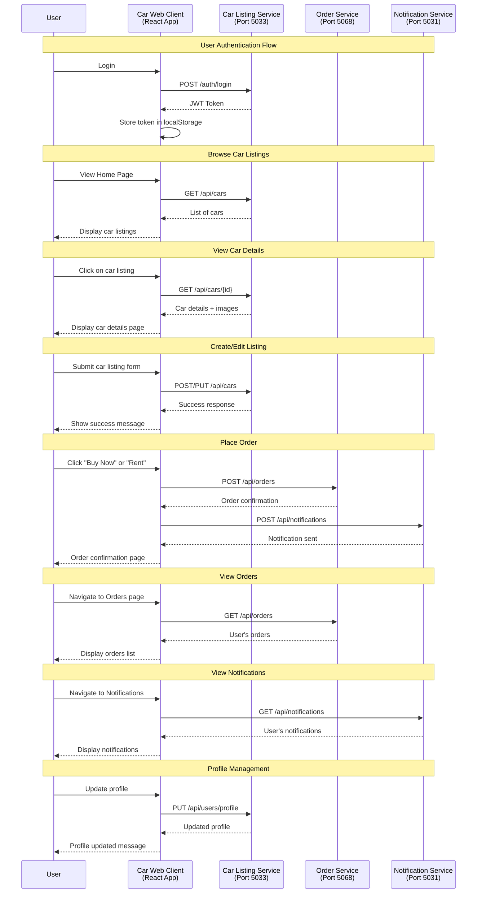

# Car Web Client

React + TypeScript web app for the Car Marketplace. Provides pages for browsing car listings, viewing details, managing listings, orders, notifications, and profile (some pages currently use mock data).

## Tech Stack
- React 19 + TypeScript
- Create React App (react-scripts)
- Testing Library + Jest

## Local Development
```bash
npm install
npm start
```
Open `http://localhost:3000`.

Backend services (optional, for real API data):
- Car Listing Service: `http://localhost:5033`
- Order Service: `http://localhost:5068`
- Notification Service: `http://localhost:5031`

If these are not running, pages will fall back to existing mock flows where applicable.

## Available Scripts
- `npm start`: Run dev server
- `npm test`: Run tests in watch mode
- `npm run build`: Build production bundle to `build/`
- `npm run eject`: Eject CRA config (irreversible)

## Features
See `FEATURES.md` for a feature overview.

## API Integration Status
See `API_INTEGRATION_STATUS.md` for details on which pages call real APIs vs. mock data.

## Project Structure
```
src/
  pages/             # Route-level pages (Home, CarDetails, Orders, etc.)
  App.tsx            # App routing
  index.tsx          # App entry
```

## System Architecture & API Flow

### Sequence Diagram: Web Client ↔ Backend Services



### Service Responsibilities

- **Car Listing Service (Port 5033)**: Manages car listings, user authentication, and user profiles
- **Order Service (Port 5068)**: Handles order creation, management, and order history
- **Notification Service (Port 5031)**: Sends and manages user notifications for orders and system updates

### Data Flow Pattern

1. **Authentication First**: All API calls require valid JWT token from Listing Service
2. **Service-Specific APIs**: Each service handles its domain-specific operations
3. **Cross-Service Communication**: Web client orchestrates calls between services as needed
4. **Fallback to Mock Data**: When services are unavailable, app uses existing mock data flows

## Environment Variables
No `.env` is required. If needed later, follow CRA conventions: variables must be prefixed with `REACT_APP_`.

## Testing
```bash
npm test
```

## Troubleshooting
- App won’t load data: ensure backend services are running on the ports above
- Type errors after dependency changes: `rm -rf node_modules && npm install`
- Port conflict on 3000: set `PORT=3001 npm start`
