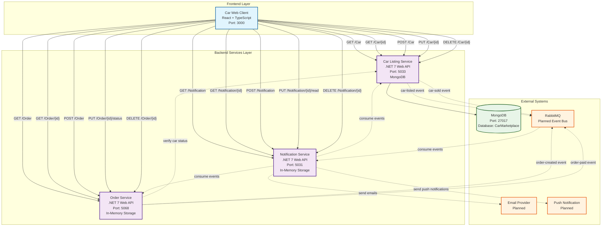

# Car Web Client

React + TypeScript web app for the Car Marketplace. Provides pages for browsing car listings, viewing details, managing listings, orders, notifications, and profile (some pages currently use mock data).

## Tech Stack
- React 19 + TypeScript
- Create React App (react-scripts)
- Testing Library + Jest

## Local Development
```bash
npm install
npm start
```
Open `http://localhost:3000`.

Backend services (optional, for real API data):
- Car Listing Service: `http://localhost:5033`
- Order Service: `http://localhost:5068`
- Notification Service: `http://localhost:5031`

If these are not running, pages will fall back to existing mock flows where applicable.

## Available Scripts
- `npm start`: Run dev server
- `npm test`: Run tests in watch mode
- `npm run build`: Build production bundle to `build/`
- `npm run eject`: Eject CRA config (irreversible)

## Features
See `FEATURES.md` for a feature overview.

## API Integration Status
See `API_INTEGRATION_STATUS.md` for details on which pages call real APIs vs. mock data.

## Project Structure
```
src/
  pages/             # Route-level pages (Home, CarDetails, Orders, etc.)
  App.tsx            # App routing
  index.tsx          # App entry
```

## Environment Variables
No `.env` is required. If needed later, follow CRA conventions: variables must be prefixed with `REACT_APP_`.

## Testing
```bash
npm test
```

## Troubleshooting
- App won’t load data: ensure backend services are running on the ports above
- Type errors after dependency changes: `rm -rf node_modules && npm install`
- Port conflict on 3000: set `PORT=3001 npm start`
# Car Marketplace System Architecture

## System Overview
This diagram shows the architecture of a car marketplace system consisting of 4 microservices and a React web client.

## Architecture Diagram



## Current vs. Planned Architecture

### ✅ Currently Implemented
- **Web Client ↔ Car Listing Service**: Full CRUD operations for car listings
- **Web Client ↔ Order Service**: Full CRUD operations for orders
- **Web Client ↔ Notification Service**: Full CRUD operations for notifications
- **Car Listing Service ↔ MongoDB**: Persistent storage for car data

### 🔄 Planned/In Progress
- **Event-Driven Communication**: RabbitMQ integration for service-to-service communication
- **Service Dependencies**: Order service verifying car status with listing service
- **Notification Triggers**: Automatic notifications based on system events
- **External Integrations**: Email and push notification providers

### 📊 Data Flow
1. **User Actions** → Web Client
2. **Web Client** → Appropriate Microservice (REST API calls)
3. **Microservices** → Process business logic and store data
4. **Future**: Events published to RabbitMQ for cross-service communication
5. **Future**: Notification service automatically triggers user notifications

## Service Responsibilities

- **Car Listing Service**: Manages car inventory, listings, and availability
- **Order Service**: Handles purchase orders, payment status, and order lifecycle
- **Notification Service**: Manages user notifications and communication
- **Web Client**: Provides user interface and orchestrates user interactions

## Technology Stack
- **Frontend**: React 19 + TypeScript
- **Backend**: .NET 7 Web APIs
- **Database**: MongoDB (Car Listing Service)
- **Storage**: In-Memory (Order & Notification Services, planned to move to persistent storage)
- **Communication**: REST APIs (current), RabbitMQ events (planned)
- **Documentation**: Swagger/OpenAPI for all services 


# Car Marketplace System Architecture

## System Overview
This diagram shows the architecture of a car marketplace system consisting of 4 microservices and a React web client.

## Architecture Diagram


## Current vs. Planned Architecture

### ✅ Currently Implemented
- **Web Client ↔ Car Listing Service**: Full CRUD operations for car listings
- **Web Client ↔ Order Service**: Full CRUD operations for orders
- **Web Client ↔ Notification Service**: Full CRUD operations for notifications
- **Car Listing Service ↔ MongoDB**: Persistent storage for car data

### 🔄 Planned/In Progress
- **Event-Driven Communication**: RabbitMQ integration for service-to-service communication
- **Service Dependencies**: Order service verifying car status with listing service
- **Notification Triggers**: Automatic notifications based on system events
- **External Integrations**: Email and push notification providers

### 📊 Data Flow
1. **User Actions** → Web Client
2. **Web Client** → Appropriate Microservice (REST API calls)
3. **Microservices** → Process business logic and store data
4. **Future**: Events published to RabbitMQ for cross-service communication
5. **Future**: Notification service automatically triggers user notifications

## Service Responsibilities

- **Car Listing Service**: Manages car inventory, listings, and availability
- **Order Service**: Handles purchase orders, payment status, and order lifecycle
- **Notification Service**: Manages user notifications and communication
- **Web Client**: Provides user interface and orchestrates user interactions

## Technology Stack
- **Frontend**: React 19 + TypeScript
- **Backend**: .NET 7 Web APIs
- **Database**: MongoDB (Car Listing Service)
- **Storage**: In-Memory (Order & Notification Services, planned to move to persistent storage)
- **Communication**: REST APIs (current), RabbitMQ events (planned)
- **Documentation**: Swagger/OpenAPI for all services 