# Car Web Client

React + TypeScript web app for the Car Marketplace. Provides pages for browsing car listings, viewing details, managing listings, orders, notifications, and profile (some pages currently use mock data).

## Tech Stack
- React 19 + TypeScript
- Create React App (react-scripts)
- Testing Library + Jest

## Local Development
```bash
npm install
npm start
```
Open `http://localhost:3000`.

Backend services (optional, for real API data):
- Car Listing Service
- Order Service  
- Notification Service

If these are not running, pages will fall back to existing mock flows where applicable.

## Available Scripts
- `npm start`: Run dev server
- `npm test`: Run tests in watch mode
- `npm run build`: Build production bundle to `build/`
- `npm run eject`: Eject CRA config (irreversible)

## Features
See `FEATURES.md` for a feature overview.

## API Integration Status
See `API_INTEGRATION_STATUS.md` for details on which pages call real APIs vs. mock data.

## Project Structure
```
src/
  pages/             # Route-level pages (Home, CarDetails, Orders, etc.)
  App.tsx            # App routing
  index.tsx          # App entry
```

## System Architecture & API Flow

### Sequence Diagram: Web Client ↔ Backend Services

```mermaid
sequenceDiagram
    participant User
    participant WebClient as Car Web Client<br/>(React App)
    participant ListingService as Car Listing Service
    participant OrderService as Order Service
    participant NotificationService as Notification Service

    Note over User,NotificationService: 1. Browse Car Listings (✅ API Integrated)
    User->>WebClient: View Home Page
    WebClient->>ListingService: GET /Car
    ListingService-->>WebClient: List of cars (MongoDB)
    WebClient-->>User: Display car listings with search/filter

    Note over User,NotificationService: 2. View Car Details (✅ API Integrated)
    User->>WebClient: Click on car listing
    WebClient->>ListingService: GET /Car/{id}
    ListingService-->>WebClient: Car details (id, brand, model, year, mileage, condition, price, description)
    WebClient-->>User: Display car details page

    Note over User,NotificationService: 3. Create/Edit Listing (❌ Mock Data)
    User->>WebClient: Submit car listing form
    Note right of WebClient: Currently uses mock data<br/>TODO: Implement POST/PUT /Car

    Note over User,NotificationService: 4. Place Order (❌ Mock Data)
    User->>WebClient: Click "Buy Now" or "Rent"
    Note right of WebClient: Currently uses mock data<br/>TODO: Implement POST /Order

    Note over User,NotificationService: 5. View Orders (❌ Mock Data)
    User->>WebClient: Navigate to Orders page
    Note right of WebClient: Currently uses mock data<br/>TODO: Implement GET /Order

    Note over User,NotificationService: 6. View Notifications (❌ Mock Data)
    User->>WebClient: Navigate to Notifications
    Note right of WebClient: Currently uses mock data<br/>TODO: Implement GET /Notification

    Note over User,NotificationService: 7. User Authentication (❌ Mock Data)
    User->>WebClient: Login/Register
    Note right of WebClient: Currently uses mock data<br/>TODO: Implement auth endpoints

    Note over User,NotificationService: 8. Profile Management (❌ Mock Data)
    User->>WebClient: Update profile
    Note right of WebClient: Currently uses mock data<br/>TODO: Implement user profile endpoints
```



### API Endpoints & Data Models

**Car Listing Service**
- `GET /Car` - Get all cars
- `GET /Car/{id}` - Get car by ID
- `POST /Car` - Create new car listing
- `PUT /Car/{id}` - Update car listing
- `DELETE /Car/{id}` - Delete car listing

**Order Service**
- `GET /Order` - Get all orders
- `GET /Order/{id}` - Get order by ID
- `POST /Order` - Create new order
- `PUT /Order/{id}/status` - Update order status
- `DELETE /Order/{id}` - Delete order

**Notification Service**
- `GET /Notification` - Get all notifications
- `GET /Notification/{id}` - Get notification by ID
- `POST /Notification` - Create new notification
- `PUT /Notification/{id}/read` - Mark as read
- `DELETE /Notification/{id}` - Delete notification

### Data Models

**Car Model**
```json
{
  "id": "string (MongoDB ObjectId)",
  "brand": "string",
  "model": "string", 
  "year": "number",
  "mileage": "number",
  "condition": "string",
  "price": "decimal",
  "description": "string"
}
```

**Order Model**
```json
{
  "id": "Guid",
  "carId": "string",
  "buyerId": "string",
  "status": "string (pending|paid|cancelled)",
  "createdAt": "DateTime",
  "paidAt": "DateTime?",
  "amount": "decimal"
}
```

**Notification Model**
```json
{
  "id": "Guid",
  "userId": "string",
  "message": "string",
  "type": "string (email|push)",
  "createdAt": "DateTime",
  "isRead": "boolean"
}
```

### Service Responsibilities

- **Car Listing Service**: 
  - ✅ Manages car listings (CRUD operations)
  - ❌ User authentication (not implemented yet)
  - ❌ User profiles (not implemented yet)
  - Uses MongoDB for data persistence
  - TODO: Implement RabbitMQ event publishing for 'car-listed' events

- **Order Service**: 
  - ✅ Handles order creation, management, and order history
  - Uses in-memory storage (List<Order>)
  - TODO: Verify car status with car-listing-service
  - TODO: Implement RabbitMQ event publishing for 'order-created' and 'order-paid' events

- **Notification Service**: 
  - ✅ Sends and manages user notifications
  - Uses in-memory storage (List<Notification>)
  - TODO: Listen to events from RabbitMQ and create notifications automatically

### Data Flow Pattern

1. **Partial API Integration**: Only car listings (GET operations) are fully integrated
2. **Service-Specific APIs**: Each service handles its domain-specific operations independently
3. **Mock Data Fallback**: Most features still use mock data while waiting for full API integration
4. **Future Event-Driven Architecture**: Services will communicate via RabbitMQ events (planned)
5. **Current State**: 
   - ✅ Car browsing and details work with real backend
   - ❌ User management, orders, notifications use mock data
   - 🔄 Ready for incremental API integration as backend features are completed

## Environment Variables
No `.env` is required. If needed later, follow CRA conventions: variables must be prefixed with `REACT_APP_`.

## Testing
```bash
npm test
```

## Troubleshooting
- App won’t load data: ensure backend services are running on the ports above
- Type errors after dependency changes: `rm -rf node_modules && npm install`
- Port conflict on 3000: set `PORT=3001 npm start`
